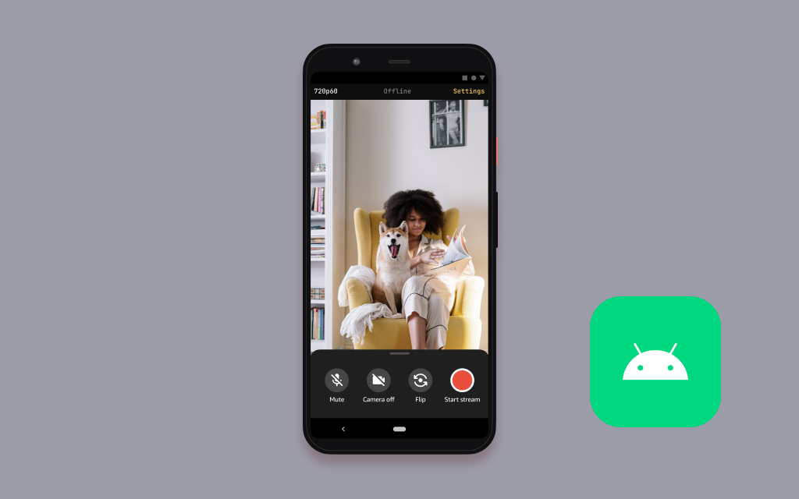

# Amazon IVS Broadcast for Android Demo

This repository contains a demo app, which shows how to use the Amazon IVS mobile broadcasting SDK to create a mobile streaming app on Android using Kotlin.

## Setup

1. Clone the repository to your local machine.
2. Open the repository in [Android Studio](https://developer.android.com/studio), or an IDE of your choice.
3. (Optional)* Refer to the [Streaming to Amazon IVS](#streaming-to-amazon-ivs) section of this readme to set up the app for streaming.
4. Run the application on an emulated device or a physical device running API level 29 or later.

*You can run and build this app without an Amazon IVS Channel, but you will need an Amazon IVS Channel in order to start broadcasting.

## Streaming to Amazon IVS

### Prerequisites

**IMPORTANT NOTE:** Using your own stream will create and consume AWS resources, which will cost money.

1. Create and set up an Amazon IVS channel. A guide is available here: [Getting started with Amazon IVS](https://docs.aws.amazon.com/ivs/latest/userguide/GSIVS.html).

### Referencing your stream in the app

1. Open the [Amazon IVS Console](https://console.aws.amazon.com/ivs) and navigate to the channel you would like to use.
2. Open the App's `build.gradle` file and find lines 18-20.
3. Copy the _Ingest Server_ for the channel and paste it into the `SERVER_URL` field on line 18 between the two escaped quotes. The resulting line should look like the following: `buildConfigField "String", "SERVER_URL", "\"rtmps://<ingest_server_url>:443/app/\""`
4. Copy the _Stream Key_ for the channel and paste it into the `STREAM_KEY` field on line 19 between the two escaped quotes.
5. Copy the _Playback URL_ for the channel and paste it into the `PLAYBACK_URL` field on line 20 between the two escaped quotes.
6. Android Studio will ask to sync the project since the gradle file has been changed. Select `Sync now` to sync.
7. Save and build the application.

You can also change the values for any of these fields in the app settings once you have launched the app in the Android Emulator, or a physical Android device.

## Known Issues
- The app is currently locked to portrait orientation because of a potential issue on some devices. A fix is being investigated.
- Screen sharing more than once during a broadcast session can lead to app instability and unexpected behavior. A fix for this issue is being investigated.
- This app has only been tested on devices running API level 29 or later. While this app may work on devices running older versions of Android, it has not been tested on them.

## More Documentation

+ [Amazon IVS Android Broadcast SDK Guide](https://docs.aws.amazon.com/ivs/latest/userguide/broadcast-android.html)
+ [More code samples and demos](https://www.ivs.rocks/examples)

## License
This project is licensed under the MIT-0 License. See the LICENSE file.
